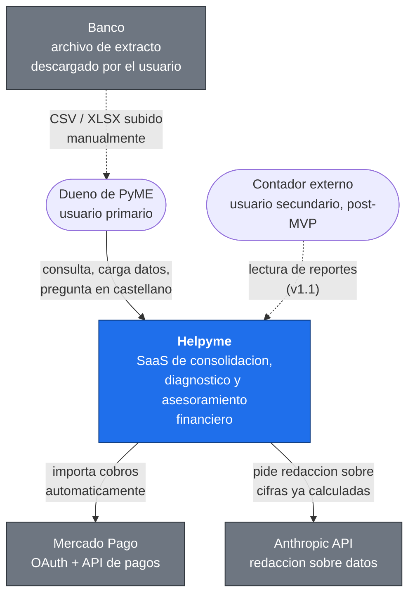
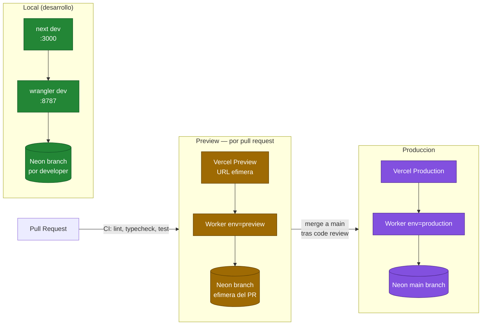
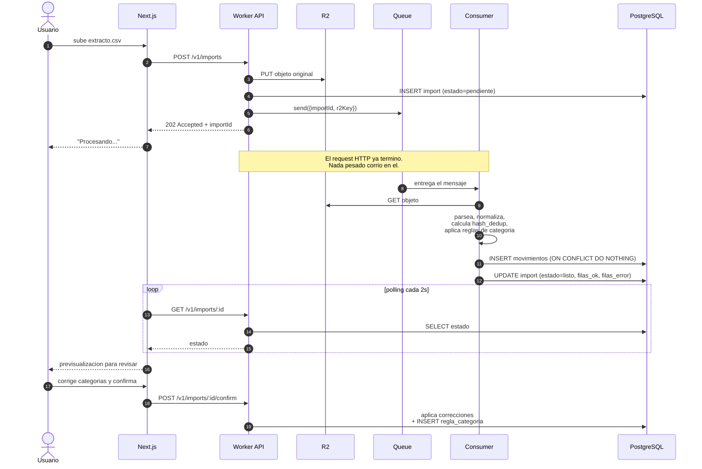
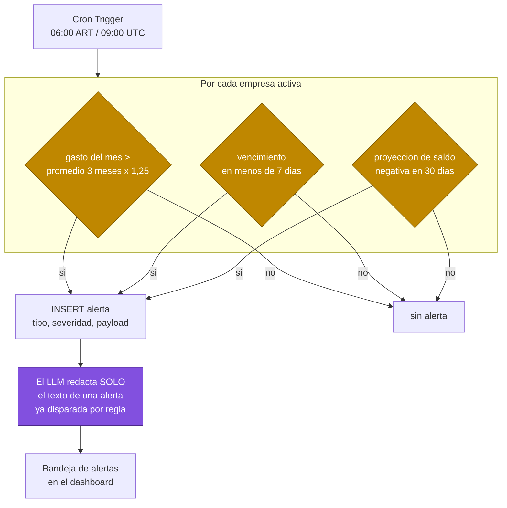
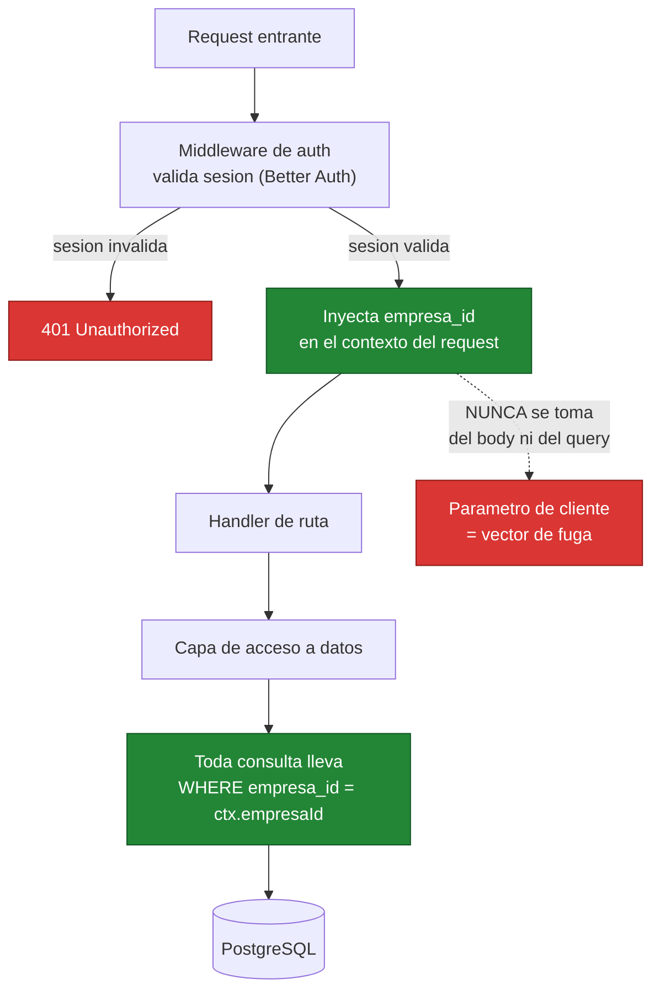

# Diagramas — Helpyme

Complementa el diagrama cloud principal de
[01-arquitectura.md](./01-arquitectura.md). Todos los diagramas son Mermaid, así
que se renderizan directo en GitHub y viven versionados junto al código: si la
arquitectura cambia, el diagrama cambia en el mismo pull request.

---

## 1. Contexto del sistema (C4 nivel 1)

Quiénes usan Helpyme y con qué sistemas externos habla.

**Nota de diseño:** el banco aparece con línea punteada y pasando *por el
usuario*. No hay integración directa —es la decisión de alcance más importante
del MVP y está justificada en [ADR-0009](./adr/0009-sin-agregacion-bancaria.md).

---

## 2. Despliegue y entornos

El **branching de base de datos de Neon** es lo que hace viable este esquema:
cada PR obtiene una copia del esquema de producción sin duplicar
infraestructura ni mantener seeds a mano. Es la razón principal de
[ADR-0002](./adr/0002-persistencia-neon-postgres.md).

---

## 3. Ingesta asíncrona de un extracto

El flujo que justifica la existencia de la cola. El endpoint HTTP **no parsea
nada**: guarda y encola.

Puntos de diseño que importan:

- **`202 Accepted`, no `200`.** La API dice «lo recibí», no «lo terminé». El
  contrato con el frontend es explícito sobre la asincronía.
- **`ON CONFLICT DO NOTHING`** sobre el índice único de `hash_dedup`: la
  deduplicación de extractos con períodos solapados la resuelve la base, no un
  `SELECT` previo que sería una condición de carrera.
- **Reintentos y DLQ.** Si el consumer falla, Queues reintenta; agotados los
  intentos, el mensaje va a una *dead letter queue* y el import queda en estado
  `error` con el detalle visible para el usuario.
- **La corrección del usuario genera una regla**, no solo arregla una fila. Es
  lo que hace que el segundo import cueste menos trabajo que el primero.

---

## 4. Recálculo diario de alertas (cron)

Sin procesos residentes, la tarea programada es un *cron trigger* del Worker.

**La condición la evalúa SQL; el LLM solo redacta.** Si el modelo decidiera
*cuándo* alertar, cada corrida costaría dinero y las alertas no serían
reproducibles ni auditables. Así, dos corridas sobre los mismos datos disparan
exactamente las mismas alertas.

---

## 5. Aislamiento multi-tenant

Cómo se garantiza que una empresa no vea datos de otra.

`empresa_id` se toma **siempre de la sesión del servidor y nunca de un parámetro
del cliente**. Un `empresaId` que viaja en el body o en el query string es un
IDOR esperando a pasar. El detalle completo, incluidos los tests que lo
verifican, está en [06-seguridad.md](./06-seguridad.md).
