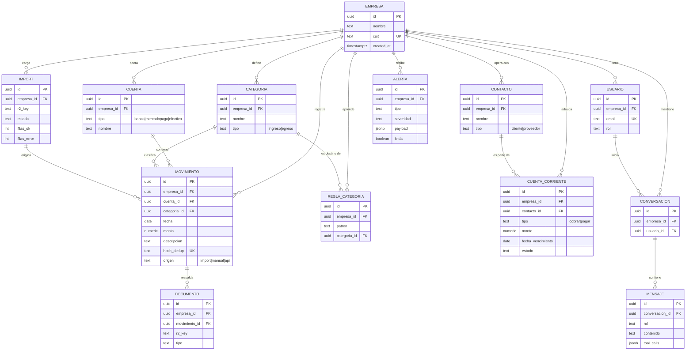

# Modelo de datos — Helpyme

Implementación tipada en
[`packages/db/src/schema.ts`](../packages/db/src/schema.ts). Este documento
explica el *porqué*; el esquema es la fuente de verdad.

---

## 1. Regla de oro

> **Toda tabla de negocio lleva `empresa_id`. Toda consulta filtra por
> `empresa_id`.**

Esa es la garantía de aislamiento multi-tenant. No es una convención de estilo:
es el invariante del que depende que una PyME no vea la plata de otra. Las
únicas tablas sin `empresa_id` son las de identidad (`usuario`, sesiones), donde
la pertenencia se expresa al revés.

---

## 2. Diagrama entidad-relación



---

## 3. Decisiones de modelado que hay que poder defender

### 3.1 `numeric`, nunca `float`, para dinero

Los montos se almacenan como `numeric(14, 2)`. Un `double precision` no puede
representar `0.1` exactamente, y en un producto financiero los errores de
redondeo se acumulan hasta que un total no cierra contra el extracto del banco.
`numeric` es aritmética decimal exacta.

En TypeScript, Drizzle devuelve `numeric` como **string**, no como `number`, y
eso es deliberado: forzar la conversión explícita evita que un `Number()`
silencioso reintroduzca el error de punto flotante. Los cálculos monetarios se
hacen en SQL, donde la precisión está garantizada.

### 3.2 `hash_dedup` con índice único por empresa

El usuario va a subir extractos con períodos solapados —es el comportamiento
normal, no un error. La deduplicación se resuelve con un hash de
`(fecha + monto + descripción normalizada)` y un **índice único sobre
`(empresa_id, hash_dedup)`**.

Que la restricción viva en la base y no en la aplicación importa: un
`SELECT ... IF NOT EXISTS ... INSERT` es una condición de carrera cuando dos
imports corren en paralelo. Con el índice único, el `INSERT ... ON CONFLICT DO
NOTHING` es atómico.

El hash incluye `empresa_id` en su ámbito por el índice compuesto: dos empresas
distintas pueden legítimamente tener el mismo movimiento.

### 3.3 `categoria_id` es nullable — a propósito

Un movimiento sin categorizar es un estado **válido y visible**, no un error a
esconder. El dashboard muestra un contador de «movimientos sin categorizar»
porque una categorización incorrecta propaga error a todos los indicadores. Es
preferible que el usuario vea que faltan 12 movimientos por clasificar a que el
sistema los meta en «Otros» y muestre un resultado que parece completo.

### 3.4 `mensaje.tool_calls` en `jsonb`

Se persiste **qué funciones invocó el modelo y con qué argumentos** en cada
turno. Sirve para tres cosas: reconstruir la conversación en el turno siguiente
(el runtime no tiene estado en memoria), auditar que una cifra dada al usuario
provino de una función real, y depurar cuando el modelo elige mal la
herramienta.

Es la contracara técnica del `AI-DECISIONS.md`: trazabilidad de lo que hizo la
IA, esta vez en tiempo de ejecución.

### 3.5 Documentos por referencia, no por contenido

`documento` guarda una `r2_key`, no el archivo. Postgres almacena metadatos;
R2 almacena bytes. Meter binarios en la base infla los backups, encarece cada
consulta y desperdicia el almacenamiento más caro del stack en el dato más
frío.

Los originales se conservan **por trazabilidad**: si un cálculo se cuestiona, se
puede volver al extracto tal como lo subió el usuario.

---

## 4. Índices previstos

El acceso siempre es «una empresa, un rango de fechas», así que los índices lo
reflejan.

| Tabla | Índice | Motivo |
|---|---|---|
| `movimiento` | `(empresa_id, fecha DESC)` | Listados y agregaciones del dashboard, que son el 80 % de las lecturas |
| `movimiento` | `UNIQUE (empresa_id, hash_dedup)` | Deduplicación atómica de imports |
| `movimiento` | `(empresa_id, categoria_id)` | Distribución de gastos por categoría |
| `cuenta_corriente` | `(empresa_id, fecha_vencimiento)` | Proyección de caja y alertas de vencimiento |
| `alerta` | `(empresa_id, leida, created_at DESC)` | Bandeja de alertas no leídas |
| `mensaje` | `(conversacion_id, created_at)` | Reconstrucción del historial en cada turno |
| `usuario` | `UNIQUE (email)` | Login |

Ninguno de estos índices es especulativo: cada uno corresponde a una consulta
concreta de la capa de cálculo descrita en
[01-arquitectura.md](./01-arquitectura.md#32-capa-de-cálculo--determinística).

---

## 5. Migraciones

Se versionan con **Drizzle Kit** y viven en `packages/db/drizzle/`.

```bash
npm run db:generate    # genera el SQL a partir del cambio en schema.ts
npm run db:migrate     # aplica las migraciones pendientes
```

Reglas del equipo:

1. **El SQL generado se commitea.** Es parte del historial revisable; un
   reviewer tiene que poder ver qué le pasa a la base en ese PR.
2. **Nunca se edita una migración ya mergeada a `main`.** Si está mal, se
   agrega una nueva que corrija.
3. **Toda migración se prueba primero en la branch de Neon del PR**, que tiene
   el mismo esquema que producción.
