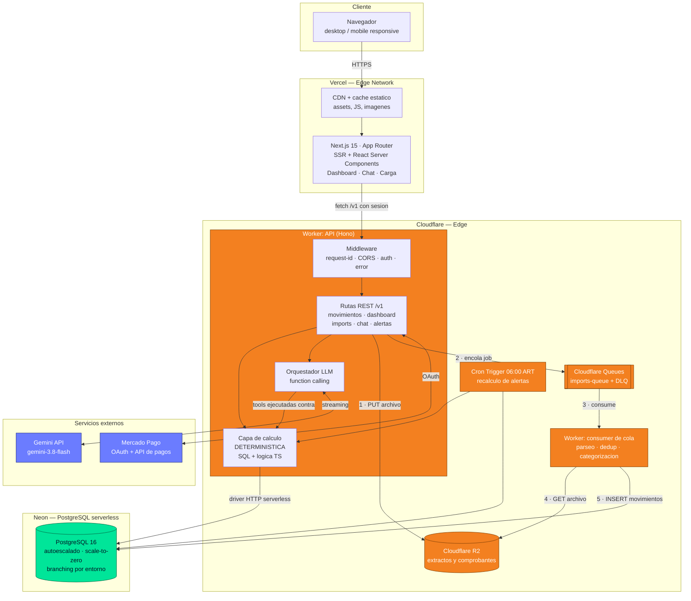
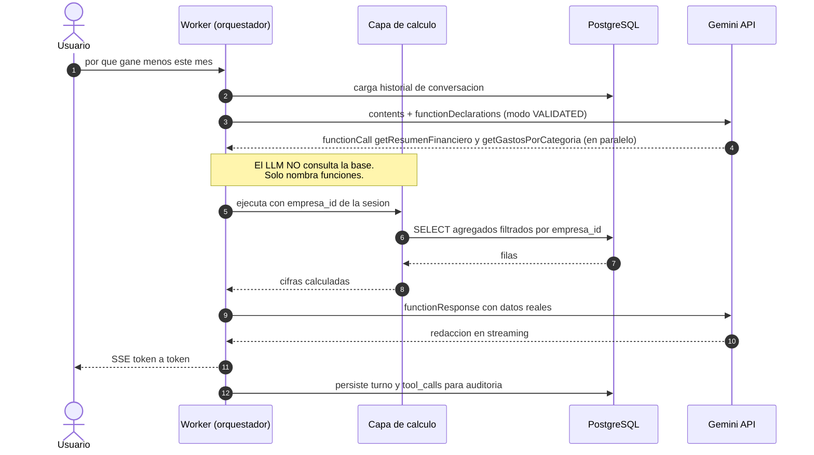

# Arquitectura — Helpyme

> **Entregable principal del Checkpoint 1** (28/09/2026) · Release `v0.1`
> Diagramas complementarios: [02-diagramas.md](./02-diagramas.md) ·
> Decisiones justificadas una por una: [adr/](./adr/)

---

## 1. Vista general

Helpyme es un **SaaS multi-tenant, serverless y desacoplado**. Frontend y
backend se despliegan y escalan de forma independiente, sin servidores que
administrar y sin capacidad reservada.

La arquitectura responde a tres fuerzas concretas del dominio:

1. **Carga irregular y de bajo volumen.** Una PyME entra al dashboard unas pocas
   veces por semana, con un pico al cierre de mes. El cómputo debe escalar a
   cero: pagar un servidor encendido 24/7 para ese patrón no se justifica.
2. **Trabajo pesado que no entra en un request.** Parsear un extracto de miles
   de filas y categorizarlo excede el presupuesto de CPU de una invocación.
   Obliga a separar ingesta de procesamiento.
3. **Datos financieros ajenos.** Todo dato pertenece a una empresa y jamás debe
   filtrarse a otra. El aislamiento multi-tenant es un requisito de diseño, no
   una funcionalidad.

### 1.1 Diagrama cloud detallado

**Cómo leer el diagrama.** Los números `1 · … 5 ·` marcan el flujo de ingesta
asíncrona, que es el camino crítico del producto y la razón por la que existe la
cola. Nótese que `orch` —el orquestador del LLM— **nunca toca PostgreSQL
directamente**: solo puede invocar funciones de `calc`. Esa restricción está
impuesta en el código, no solo en el prompt.

---

## 2. Componentes y responsabilidades

| Componente | Servicio | Responsabilidad | Por qué acá |
|---|---|---|---|
| Frontend | Vercel | Render, dashboard, chat con streaming, formularios | Despliegue nativo de Next.js, previews por PR ([ADR-0006](./adr/0006-frontend-vercel.md)) |
| API | Cloudflare Workers + Hono | REST, autorización, cálculo, orquestación | Escalado a cero, cold start casi nulo ([ADR-0001](./adr/0001-backend-cloudflare-workers.md)) |
| Procesamiento | Workers + Queues | Parseo y categorización de extractos | Saca el trabajo pesado del request ([ADR-0005](./adr/0005-procesamiento-asincronico.md)) |
| Datos | Neon PostgreSQL | Persistencia relacional multi-tenant | Agregaciones financieras + branching ([ADR-0002](./adr/0002-persistencia-neon-postgres.md)) |
| Acceso a datos | Drizzle ORM | Consultas tipadas y migraciones | SQL explícito y tipado end-to-end ([ADR-0003](./adr/0003-orm-drizzle.md)) |
| Archivos | Cloudflare R2 | Originales para trazabilidad | Binding nativo, sin costo de egreso ([ADR-0004](./adr/0004-storage-r2.md)) |
| Auth | Better Auth | Sesiones, usuarios, organizaciones | El modelo de organizaciones es el del producto ([ADR-0008](./adr/0008-autenticacion-better-auth.md)) |
| IA | Google Gemini Flash | Redacción sobre datos verificados | *Function calling* validado ([ADR-0010](./adr/0010-modelo-llm-gemini.md)) |

---

## 3. Las tres capas del sistema

### 3.1 Ingesta y normalización

Es el punto de mayor fricción del producto y la principal causa de abandono, así
que se diseña con cuidado:

1. El usuario sube el archivo (CSV o XLSX).
2. El sistema detecta el formato conocido. **Se soportan solo los formatos de
   los bancos de los primeros clientes reales**, no todos preventivamente: cada
   banco tiene un layout distinto y ese trabajo crece sin techo.
3. Se muestra una **previsualización**: qué columna se interpretó como fecha,
   cuál como monto, cuál como descripción, y qué categoría se asignó.
4. El usuario corrige lo que esté mal y confirma.
5. Las correcciones **generan reglas persistentes**: la próxima vez que aparezca
   esa descripción, se categoriza sola.

Los duplicados se descartan por **hash de (fecha + monto + descripción
normalizada)**, porque el usuario va a subir extractos con períodos solapados.
El hash es una columna con índice único por empresa, así que la deduplicación la
garantiza la base de datos y no la lógica de aplicación.

### 3.2 Capa de cálculo — determinística

**Todos los indicadores se calculan con SQL y lógica de negocio en TypeScript.
El modelo de lenguaje no interviene en ningún cálculo.**

Indicadores del MVP:

- Ingresos y egresos del período
- Resultado del período (ingresos − egresos), **declarado en UI como resultado
  de caja**, no como ganancia contable
- Distribución de gastos por categoría y por proveedor
- Saldo disponible consolidado
- Total por cobrar y por pagar, con antigüedad
- Evolución mensual comparada
- Proyección de saldo día a día: saldo actual + cobros esperados − pagos
  comprometidos

### 3.3 Capa de IA — *function calling* estricto

El LLM recibe una pregunta en lenguaje natural, decide qué funciones invocar, y
redacta **usando exclusivamente** los datos que el backend le devuelve.

**Herramientas expuestas al modelo en el MVP** — contratos en
[`packages/shared/src/advisor-tools.ts`](../../packages/shared/src/advisor-tools.ts):

| Función | Devuelve |
|---|---|
| `getResumenFinanciero(desde, hasta)` | Ingresos, egresos, resultado, saldo |
| `getGastosPorCategoria(desde, hasta)` | Ranking de gastos agrupados |
| `getGastosPorProveedor(desde, hasta)` | Ranking por proveedor |
| `getCuentasPorCobrar()` | Deudores, montos, antigüedad |
| `getCuentasPorPagar()` | Vencimientos próximos |
| `getProyeccionCaja(dias)` | Saldo proyectado día a día |
| `simularEscenario(params)` | Resultado de la simulación |

Tres garantías, en capas independientes:

1. **`empresa_id` nunca es un parámetro del modelo.** Se inyecta desde la sesión
   al ejecutar la función. Aunque el LLM lo intentara, no puede leer datos de
   otra empresa: no tiene forma de expresarlo.
2. **Esquemas cerrados y validados**: `additionalProperties: false` en cada
   declaración y modo `VALIDATED`, que valida cada llamada del modelo con
   decodificación restringida. El input de cada herramienta cumple exactamente
   el contrato.
3. **El *system prompt* obliga a declarar la falta de datos** en lugar de
   estimarla, y toda respuesta es verificable contra el dashboard.

**Las alertas se generan por reglas, no por el LLM.** El modelo solo redacta el
texto de una alerta ya disparada. Ejemplo de regla:
`gasto_mes_actual > promedio_ultimos_3_meses * 1.25`.

---

## 4. Restricciones del runtime serverless

Estas no son detalles de implementación: **condicionan el diseño** y son la
razón de varias decisiones de arquitectura.

| Restricción | Consecuencia de diseño |
|---|---|
| **Límite de CPU por request en Workers** | El endpoint de carga solo guarda en R2 y encola. El parseo corre en un consumidor asíncrono; el frontend hace *polling* del estado del import. |
| **Workers no maneja sockets TCP como Node** | La conexión a Postgres usa el **driver serverless de Neon sobre HTTP**, no el driver `pg` tradicional. No es una preferencia: el driver TCP no funciona en este runtime. |
| **Latencia del LLM de varios segundos** | Es espera de I/O y no de CPU, así que es compatible con Workers. Pero la respuesta del chat se transmite en **streaming** para que la UI no quede congelada. |
| **Sin estado en memoria entre invocaciones** | El historial de conversación se persiste en PostgreSQL y se reenvía en cada turno. No hay sesión en RAM. |
| **Sin procesos residentes** | El recálculo diario de alertas se resuelve con un **cron trigger**, no con un daemon. |

---

## 5. Alcance del MVP

### 5.1 Dentro del alcance

| # | Funcionalidad | Descripción |
|---|---|---|
| F1 | Registro y autenticación | Alta de empresa, login, gestión de usuarios |
| F2 | Conexión con Mercado Pago | OAuth oficial, importación automática de cobros |
| F3 | Carga de extractos | CSV/XLSX, parseo y previsualización antes de confirmar |
| F4 | Carga manual de gastos | Alta de gastos y facturas con adjunto opcional |
| F5 | Motor de categorización | Reglas por palabra clave; la corrección manual genera regla |
| F6 | Cuentas por cobrar y pagar | Deudas con fecha de vencimiento y estado |
| F7 | Dashboard financiero | Ingresos, egresos, resultado, top de gastos, evolución |
| F8 | Proyección de caja | Saldo proyectado según vencimientos cargados |
| F9 | Alertas por reglas | Desvío de gasto, vencimientos próximos, saldo negativo |
| F10 | Asesor conversacional | Chat con datos reales vía *function calling* |
| F11 | Simulador de escenarios | Gasto fijo nuevo, variación de ventas, variación de costo |

### 5.2 Fuera del alcance (v1)

| Excluido | Por qué |
|---|---|
| Agregación bancaria automática | En Argentina no hay *open banking* estandarizado equivalente a Plaid o Belvo. La alternativa —scraping de homebanking— implica manejar credenciales bancarias del usuario, se rompe con cada cambio de front del banco y es un producto en sí mismo. Se reemplaza por carga de extracto. |
| Integración con AFIP | El webservice de facturación electrónica requiere certificado digital, homologación y modelado impositivo. Es un proyecto paralelo. |
| Cálculo contable formal | La ganancia contable exacta (IVA, amortizaciones, ajustes) es contabilidad, no BI. El MVP muestra resultado de caja con los supuestos visibles. |
| Modelo predictivo entrenado | *Cold start*: una PyME recién incorporada no tiene historial limpio. Sin datos, un modelo entrenado no aporta sobre un promedio móvil. |
| App móvil nativa | El frontend responsive cubre el caso de uso del MVP. |
| Multi-moneda y multi-empresa por usuario | Complejidad de modelo de datos que no aporta a la validación inicial. |

---

## 6. Requisitos no funcionales

| Atributo | Objetivo | Cómo se sostiene |
|---|---|---|
| Disponibilidad | 99,9 % mensual | Sin punto único de falla propio: todo servicio gestionado con SLA. |
| Latencia API (p95) | < 300 ms en lecturas de dashboard | Ejecución en el edge, índices por `(empresa_id, fecha)`, agregaciones en SQL. |
| Latencia del chat | Primer token < 2 s | Streaming: el usuario ve progreso antes de la respuesta completa. |
| Escalabilidad | 0 → 500 empresas sin cambiar la arquitectura | Escalado a cero y automático en cómputo y base. |
| Aislamiento | Cero fugas entre empresas | `empresa_id` obligatorio en toda tabla y toda consulta ([06-seguridad](./06-seguridad.md)). |
| Costo | < USD 30/mes en etapa MVP | Ver [05-costos-finops](./05-costos-finops.md). |
| RPO / RTO | 24 h / 4 h | Backups automáticos de Neon (PITR) + originales en R2. |

---

## 7. Riesgos técnicos y mitigaciones

| Riesgo | Impacto | Mitigación |
|---|---|---|
| El LLM inventa una cifra financiera | **Crítico** — destruye la confianza de forma permanente | *Function calling* estricto: el modelo nunca calcula, solo redacta sobre datos que le devuelve el backend |
| Categorización incorrecta propaga error a todos los indicadores | Alto | Previsualización obligatoria antes de confirmar; corrección manual que genera regla; indicador visible de movimientos sin categorizar |
| Cada banco tiene un formato de archivo distinto | Medio, crece sin techo | Soportar solo los formatos de clientes reales, con un parser genérico configurable como fallback |
| Sin historial suficiente las proyecciones no tienen valor | Medio | El sistema declara explícitamente cuándo no tiene datos suficientes, en lugar de proyectar igual |
| El usuario abandona en la carga de datos | Alto — es la fricción principal del producto | Mercado Pago automático desde el día uno: ve valor antes de subir el primer archivo |
| Manejo de datos financieros sensibles | Alto | Nunca se piden credenciales bancarias; solo OAuth de Mercado Pago; aislamiento por `empresa_id`; archivos en R2 con URL firmada de vida corta |
| El producto se percibe como asesoramiento financiero profesional | Legal / reputacional | Posicionamiento explícito como herramienta informativa, con supuestos visibles en cada simulación |
| Costo variable de la API del LLM | Medio | Modelo de gama Flash para una tarea acotada por diseño; el modelo recibe agregados, nunca filas crudas; las alertas se generan por reglas, no por el modelo. Ver [05-costos-finops](./05-costos-finops.md) |

---

## 8. Roadmap post-MVP

- **v1.1** — Más formatos de extracto, exportación de reportes a PDF y Excel,
  acceso de solo lectura para el contador.
- **v1.2** — Integración con sistemas de facturación que expongan API.
- **v2.0** — Integración con AFIP, modelado impositivo, resultado devengado
  además de percibido.
- **v2.1** — Modelo predictivo entrenado sobre el historial acumulado, una vez
  que exista volumen real de datos.
